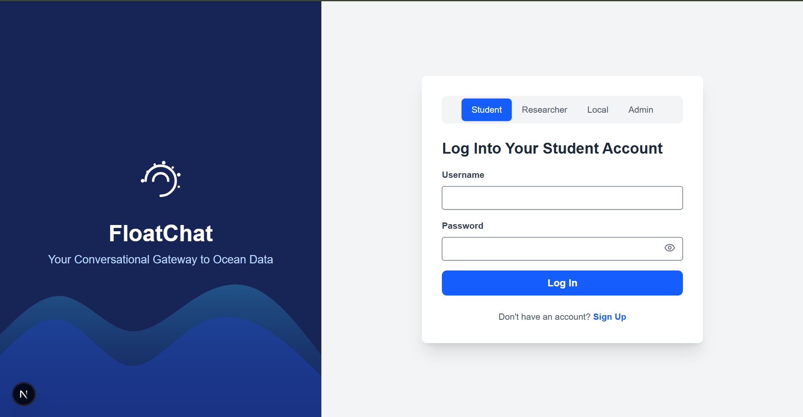
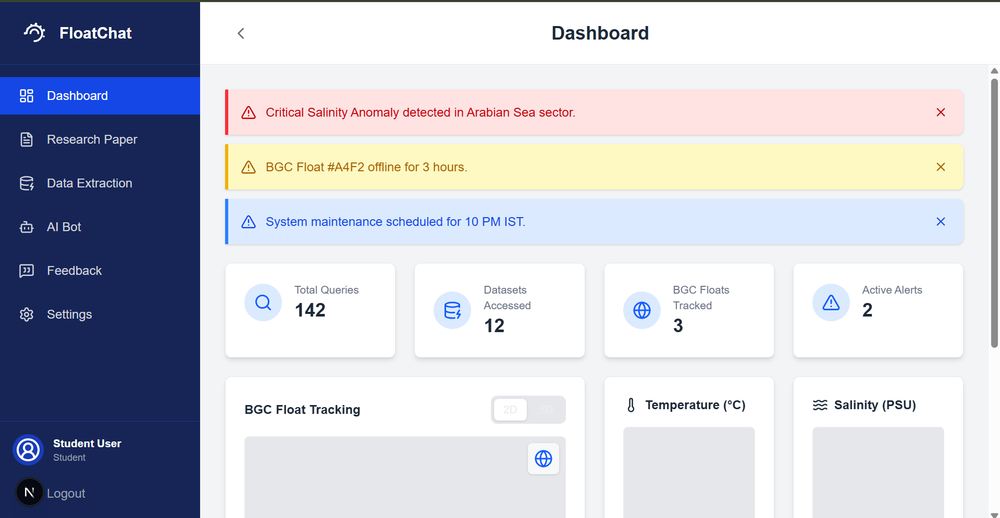

# 🌊 FloatChat

FloatChat is a multi-user collaborative platform built with **Next.js 14**, **TailwindCSS**, **Framer Motion**, and **React Icons**.  
It provides role-based dashboards for **Students, Researchers, Locals, and Administrators**, enabling seamless communication, research management, and community engagement.  

---

## 🚀 Features

- 🔑 **Role-based Authentication**
  - **Student** → Dashboard, Research Papers, AI Bot, Data Extraction, Settings  
  - **Researcher** → Includes Student features + Workspace  
  - **Local** → Community-centric interface  
  - **Admin** → Dedicated Admin Panel with 2FA  

- 🎨 **Modern UI**
  - Responsive, INCOIS-inspired design  
  - Animated role cards using **Framer Motion**  
  - Consistent blue & white professional theme  

- 🤖 **AI Chatbot Integration**
  - Gemini API support (customizable and trainable later)  

- 🌍 **Visualization Ready**
  - Planned support for **3D & 4D Maps**  
  - Data-driven visual dashboards  

---
## 🖼️ Screenshots

### Landing Page


### Dashboard


---
## 🏗️ Tech Stack

- **Framework**: [Next.js 14](https://nextjs.org/)  
- **Styling**: [Tailwind CSS](https://tailwindcss.com/)  
- **Animations**: [Framer Motion](https://www.framer.com/motion/)  
- **Icons**: [React Icons](https://react-icons.github.io/react-icons/)  

---

## 📂 Project Structure

floatchat/
│
├── app/ # Next.js app router pages
│ ├── page.tsx # Landing page (role selector)
│ ├── student/ # Student login + dashboard
│ ├── researcher/ # Researcher login + dashboard
│ ├── local/ # Local login + dashboard
│ └── admin/ # Admin login + dashboard
│
├── components/ # Shared UI components
├── public/ # Static assets (logo, images)
├── styles/ # Global styles
│
├── package.json # Dependencies & scripts
└── README.md # Project documentation


---

## ⚙️ Installation & Setup

1. **Clone the repository**
   ```bash
   git clone https://github.com/your-username/floatchat.git
   cd floatchat
